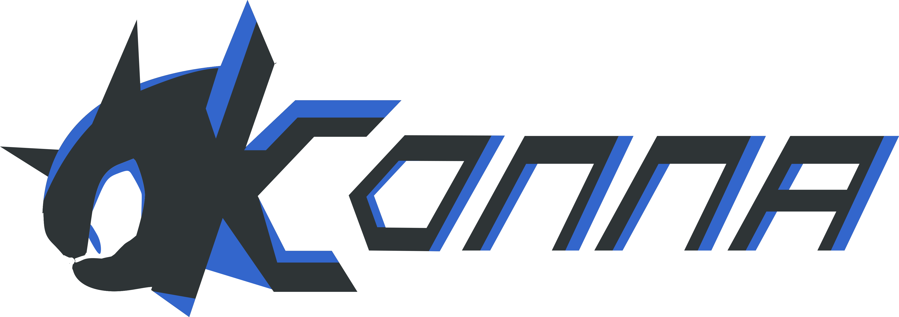



   

# Konna

Yet another free and open-source game engine (that is possibly like a framework) for roguelike games.
It is the hobby project so far, but it may turn into something bigger (that I have destroyed to make a better version)

[Project Roadmap](ROADMAP.md)

## The core principles

### The Hyperpurism

The project should use as few dependencies as possible. A dependency is to be included only in case if it implements
functionality that would be too complex to implement an independent solution (such as byte-code manipulation, code generation)

### The Hypertuningability

The engine is not for all types of games. It is not universal in that aspect. However, it could be easily modified with engine components that you can create by yourself

### The Hyperindependency

No Engine component should know about other components. They should communicate with events, tunnels and messages

## Project structure

TBD

## Getting started

TBD

## Building from source

TBD

## Project status

## Contributing

See [CONTRIBUTING.md](CONTRIBUTING.md) for more information
